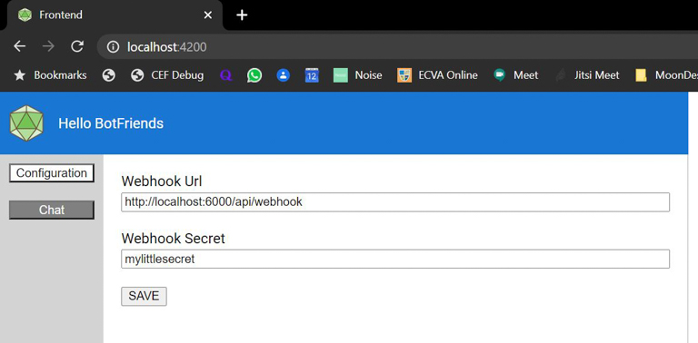
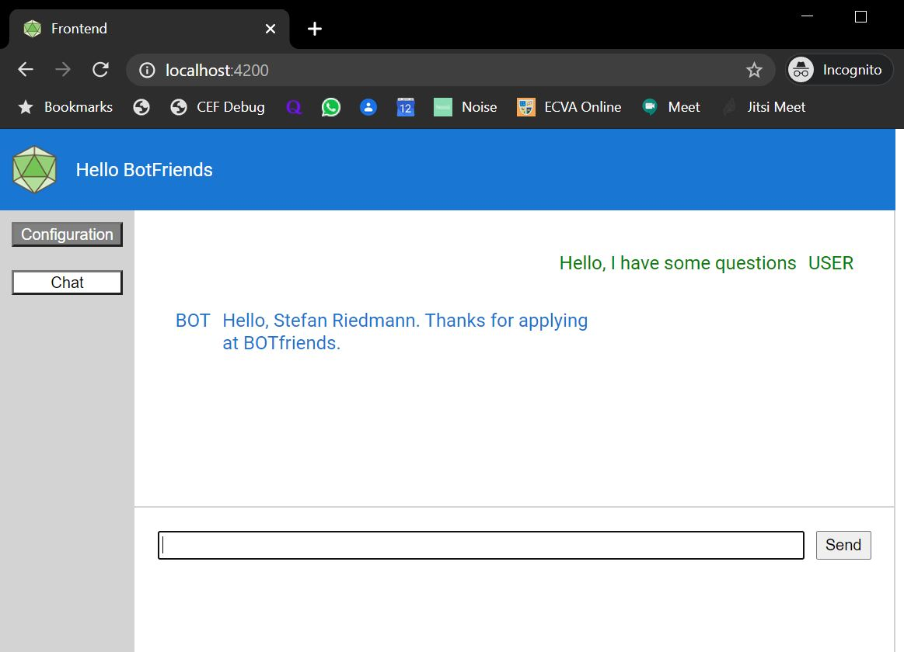

# SHORT DESCRIPTION
**Small microservice example with one Frontend and two Microservices (MS1 and MS2)**
1. The frontend only communicates with MS1
2. The frontend allows to configure the connection and an x-api-key for MS2, which is stored in a MongoDb connected to MS1
3. The frontend has a chat which sends messages to MS1
4. MS1 receives messages and forwards them to MS2 (POST), adding the x-api-key to the request header
5. MS2 validates the key, manipulates the message and returns it (RESPONSE)
6. MS1 used the RESPONSE as its own RESPONSE for the Frontend
7. The frontend displays the response as a chat message from the counterpart (Bot)

# ARCHITECTURE
## Frontend - Angular9
**The frontend basically consists of 1 service and 3 components**
### [ApiService.ts](/Frontend/src/app/servcies/)
Implements http endpoints to connect to Microservice1.
### [AppComponent.ts](/Frontend/src/app/)
Frame component including 
- Header
- Sidenav with menu
- Space for chat/configuration
### [ChatComponent.ts](/Frontend/src/app/components/chat/)
- Message List (bot/user)
- Text input (send)
- Errors are being shown as simple browser alerts
### [ConfigurationComponent.ts](/Frontend/src/app/components/configuration/)
- Reads the existing configuration from MicroService1
- Allows to change and save the configuration
### Screenshots

## Microservices
**The two Microservices are simple .NET Core API's**
### [MicroService1](/MicroService1/)
- _ApiController_ has endpoints to read/write configuration, and send chat messages
- _DatabaseService_ creates db and collection in MongoDb if necessary, and offers simple read/write operations
- _Ms2Service_ has a client implementation to send messages to Microservice2, using the configured endpoint and x-api-key
### [MicroService2](/MicroService2/)
- _app_settings.json_ contains the configuration for the expected x-api-key
- _Startup_ configures the x-api-key Authorization (every http call is checked before forwared to the Controller
- _ApiController_ has one endpoint that receives a message and replaces _{{firstname}}_ and _{{lastname}}_
## MongoDb
Just use the community edition with Mongo Shell. _Microservice1_ needs to be configured in the _appsettings.json_ or appsettings_development.json file

## SETUP
- Install [dotnet core 3.1](https://dotnet.microsoft.com/download/dotnet-core/3.1)
- Install [Node.js 12](https://nodejs.org/en/download/)
- Install [MongoDb](https://www.mongodb.com/try/download/community)

## RUN LOCALLY
- /Microservice1/dotnet run
- /Microservice2/dotnet run
- /Frontend/npm install
- /Frontend/npm run start
- Go to http://localhost:4200
- Go to _Configuration_: Endpoint="http://localhost:6000/api/webhook" - Secret="mylittlesecret" - Save
- Go to _Chat_ - Enter Message - Hit Enter

## DEBUG with Visual Studio Code
- Launch Microservice1
- Launch Microservice2
- /Frontend/npm run start
- Frontend could be debugged from VSCode, but for simplicity I use the browser integrated debugger

## TESTS
**For a more complete example, tests should be written**
**UnitTests**
- Frontend - unit tests for the frontend components and the service functions
- MS1 - unit tests for the Controller (mocking DatabaseService and Ms2Service)
- MS2 - unit test ApiController for the message response logic

**IntegrationTests**
- Microservice1 - integration tests for the DatabaseService (read/write to MongoDb)

**E2E Tests**
- E2E tests should be written using Cypress or Protractor to test the Angular application
- Test to configure MicroService2
- Test to send chat messages

# DEPLOYMENT
This example is working locally, running the frontend with 'ng serve' - which is just a debug server. To complete this is example for deployment, consider the following points
- Configure 'npm run build' to copy the build output to Microservice1/wwwroot
- Create endpoint in Microservice1 to load the Angular SPA application (index.html)
- Create two docker containers out of the Microservices
- Deploy Microservices to a docker environment (or Kubernetes) and configure the MongoDb for Microservice1

# CLOSING
This is a very simple example. Authentication and Authorization must be solved accordingly. Frontends should not handle service connection secrets, if possible. A save way would be an OAuth implementation where the user generates a OAuth code, and the Microservice1 uses it to get Token. Alternatively, the connection to MS2 must be configured in MS1 (server side), or the configuration from the Frontend must be limited to an authorized Admin account. 
